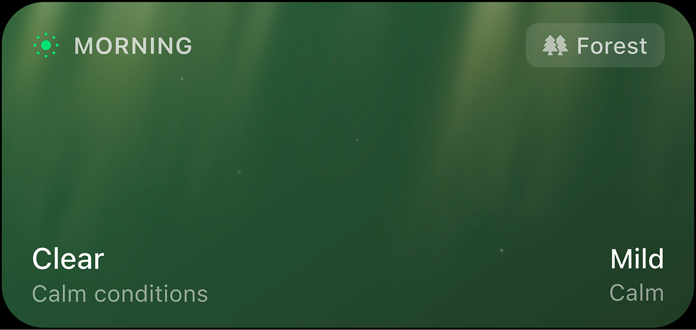

# RPG Weather Widget

A tabletop RPG weather generator with 12 biomes, dynamic weather effects, and time of day. Perfect for D&D, Pathfinder, and other TTRPGs.

**[Try it live](https://jwzy.github.io/rpg-weather/)**

## Features

- **12 Biomes** - Forest, Desert, Tundra, Swamp, Mountains, Plains, Coast, Jungle, Volcanic, Arctic, Savanna, and Cavern
- **Dynamic Weather** - Each biome has unique weather patterns (rain, snow, sandstorms, volcanic ash, etc.)
- **Cinematic Time of Day** - Morning, Afternoon, Evening, and Night with gradient-based atmospheric lighting inspired by Disney/Pixar
- **Animated Particles** - Weather effects rendered with animated particles, including god rays that emanate from the sun
- **iOS Widget Design** - Styled after iOS medium widgets (329x155pt)
- **Fullscreen Mode** - Click the widget to enter immersive fullscreen with smooth zoom animation and 2x fidelity rendering
- **Keyboard Shortcuts** - Arrow keys to quickly cycle through time and weather

## Usage

Open the page and use the control panel to:

1. Select a **time of day** (or press **←** / **→**)
2. Choose a **biome**
3. Pick a **weather condition** (or press **↑** / **↓**, or click Randomize)

The widget updates in real-time with appropriate colors, icons, and particle effects. Keyboard shortcuts also work in fullscreen mode.

## License

MIT
